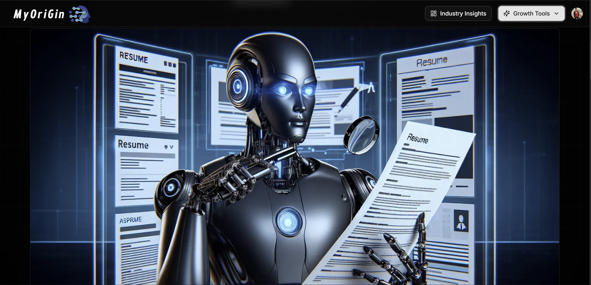
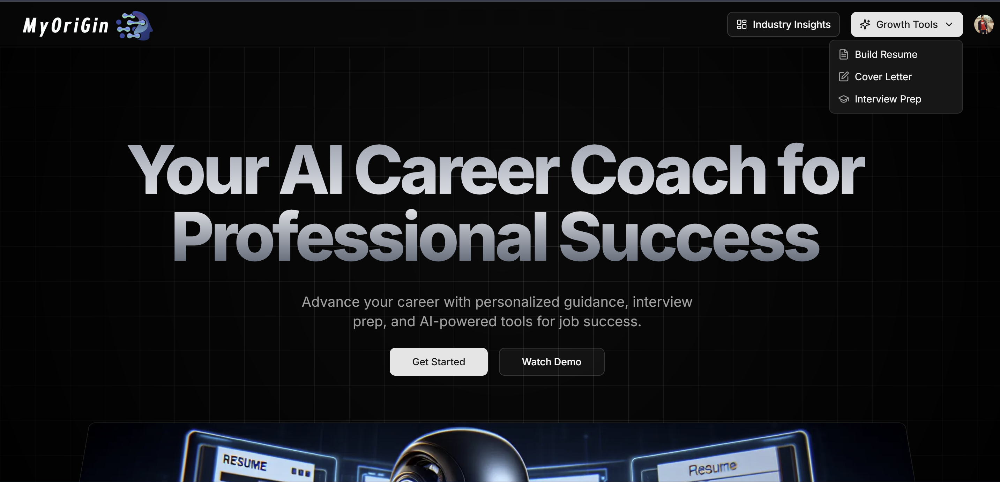

# 🚀 MyOrigin  
## AI-Powered Personalized Career Intelligence Platform

<p align="center">
  
</p>

<p align="center">
  <b>Build smarter careers with AI-driven resumes, assessments, insights, and performance tracking.</b>
</p>

---

## 🌟 About MyOrigin

**MyOrigin** is an AI-powered **Personalized Career Intelligence Platform** that helps students and professionals **build ATS-friendly resumes**, **practice AI-generated quizzes**, **track performance**, and **stay updated with industry trends** — all from a single personalized dashboard.

---

## 🖼️ Platform Preview

### 🏠 Home & Onboarding
<p align="center">
  
</p>

### 📊 Personalized Dashboard
<p align="center">
  
</p>

### 📝 ATS Resume Builder
<p align="center">
  
</p>

### 🧠 AI-Generated Quizzes
<p align="center">
  
</p>

### 📈 Industry Insights
<p align="center">
  
</p>

---

## 🎯 Key Features

### 📝 ATS-Optimized Career Documents
- AI-generated **ATS-friendly resumes**
- Smart **cover letter generation**
- Markdown-based rendering using **React Markdown**

### 🧠 AI-Powered Skill Assessment
- Personalized quizzes using **Gemini API**
- Adaptive difficulty
- Instant feedback & improvement tips

### 📊 Performance Dashboard
- Skill-wise progress tracking
- Weekly growth analytics
- Career readiness indicators

### 📈 Industry Intelligence
- **Weekly updated industry insights**
- Role-based recommendations
- Market trend analysis

### 📄 Export & Sharing
- Resume and reports exportable as **PDF**
- Clean formatting using **HTML → PDF**

---

## 🛠️ Tech Stack

<p align="center">
  
</p>

- **Next.js**
- **React.js**
- **PostgreSQL**
- **Clerk (Authentication)**
- **Google Gemini API**
- **React Markdown**
- **HTML2PDF**

---

## 🧩 Architecture Overview

<p align="center">
  
</p>

---

### 1️⃣ Clone Repository
```bash
git clone https://github.com/your-username/myorigin.git
cd myorigin
```

2️⃣ Install Dependencies
```bash
Copy code
npm install
```

3️⃣ Setup Environment Variables
```bash
Create a .env file in the root directory.

touch .env
```

Add the following variables:
```bash
# Neon PostgreSQL Database
DATABASE_URL="postgresql://<username>:<password>@<neon-host>/<database>?sslmode=require"

# Clerk Authentication
CLERK_SECRET_KEY=your_clerk_secret_key
NEXT_PUBLIC_CLERK_PUBLISHABLE_KEY=your_clerk_publishable_key

# Gemini AI
GEMINI_API_KEY=your_gemini_api_key

# Inngest
INNGEST_EVENT_KEY=your_inngest_event_key
INNGEST_SIGNING_KEY=your_inngest_signing_key
```

4️⃣ Setup Prisma (Database)
```bash
Generate Prisma Client:

npx prisma generate
```

Push schema to Neon DB:
```bash
npx prisma db push
```

(Optional – view database)
```bash
npx prisma studio
```

5️⃣ Setup Inngest (Background Jobs)

Start Inngest Dev Server:
```bash
npx inngest dev
```

This enables:

Background jobs

Event-driven workflows

Async AI tasks (quizzes, insights, reports)

📌 Keep this running in a separate terminal during development.

6️⃣ Start the Application
```bash
npm run dev
```

7️⃣ Open in Browser

Visit 👉 http://localhost:3000

🎉 MyOrigin is now running locally

### 🔐 Security & Privacy

-Secure authentication using Clerk

-Encrypted user data in PostgreSQL

-Privacy-first AI interactions


### 👨‍💻 Author

Dhruv Garg
B.Tech @ NIT Kurukshetra
AI | Full-Stack | Open-source

MyOrigin helps users not just prepare for jobs — but understand their career origin.
